# Smart Pointers

### Smart Pointers in C++
   
*   Problem with Normal Pointers:
    *   A pointer may or may not point to an object
    *   A pointer does not indicate who owns the object
    *   Smart Pointers are used to express ownership

*   3 Types of Smart Pointers:

    | Description | Link                                              |
    | ----------- | ------------------------------------------------- |
    | Unique_ptr  | Represents exclusive ownership                    |
    | Shared_ptr  | Represents shared ownership                       |
    | Weak_ptr    | To break loops in circular shared data structures |
    
        
*   We can make pointers to work in a way that many normal pointers can't do
    *  Automatic Pointer Destruction
    *  Reference Counting
        
*   Idea:
    * Make another class with
        - Pointer
        -  Destructor
        -  Overloaded Operators *	->
	
	
	
### Smart Pointer Implementation:

*   There are 8 major things to implement in a Smart Pointer Implementation:
    
    1. Empty Constructor

    2. Explicit Constructor

    3. Destructor

    4. Null Pointer Semantics

    5. Move Semantics:
        1. Move Constructor
        2. Move Assignment

    6. Copy Semantics:
        1. Copy Constructor
        2. Copy Assignment

    7. Operator Overloading:
        1. For Dereferencing operator
        2. For Arrow operator

    8. Others:
        1. Get
      	2. Swap 
   
*   **Images**:

    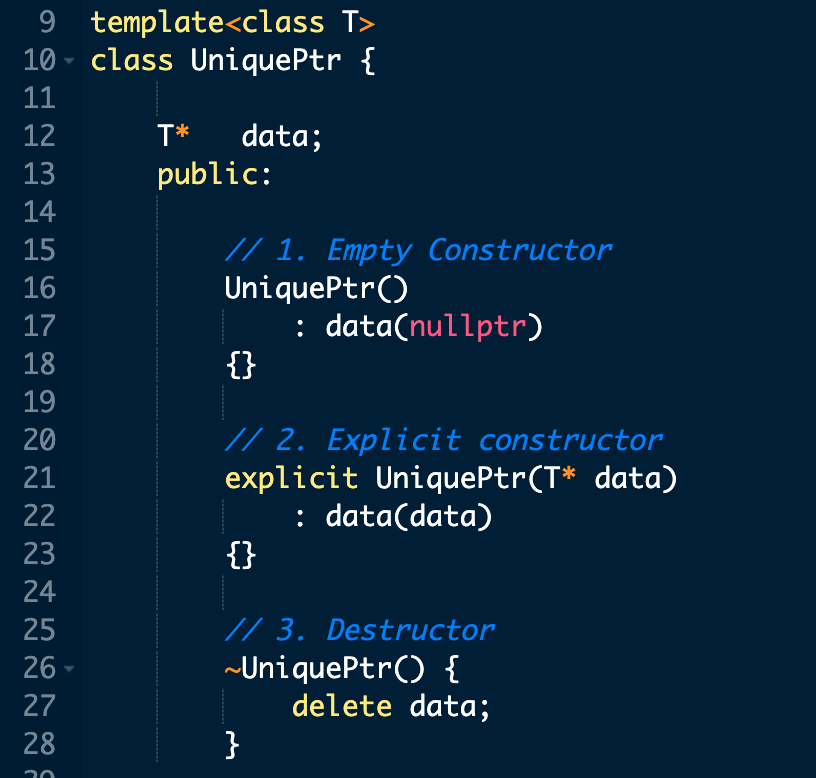

    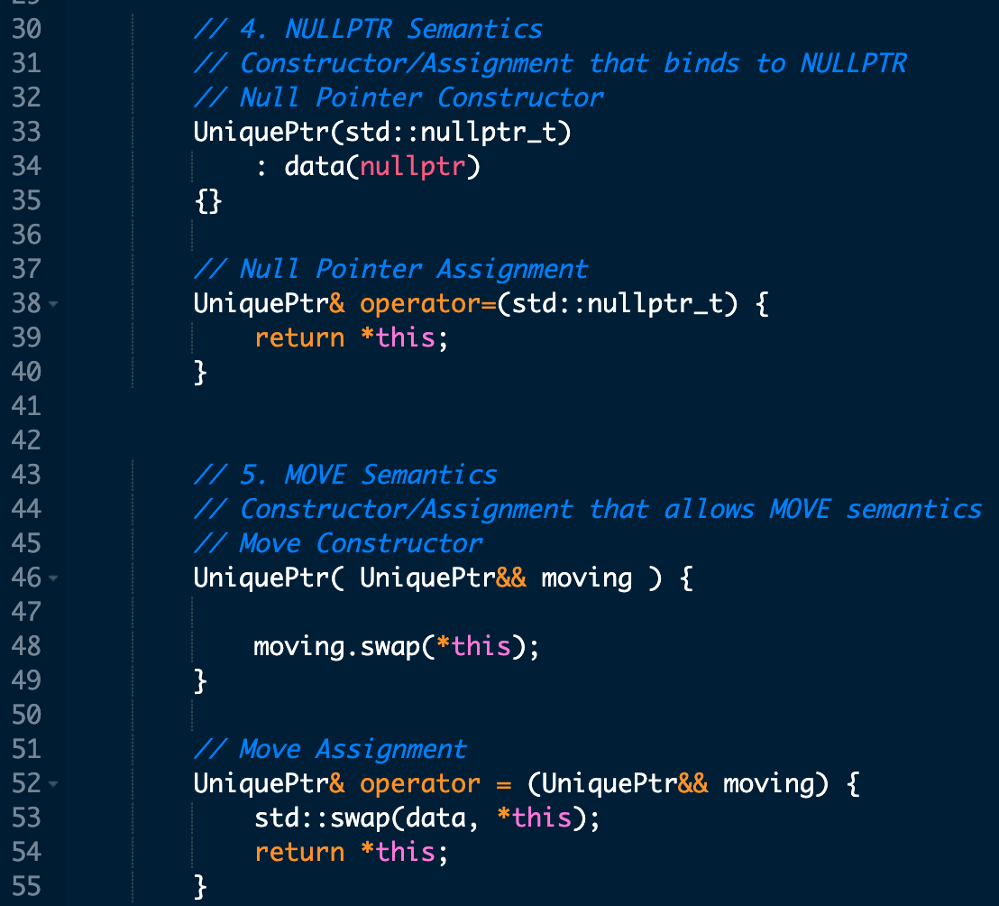

    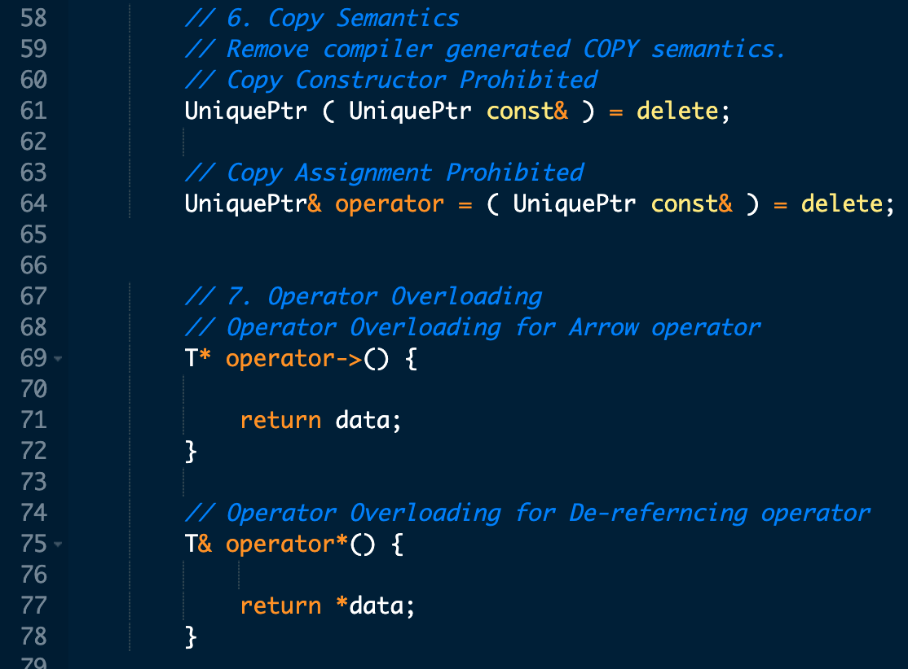

    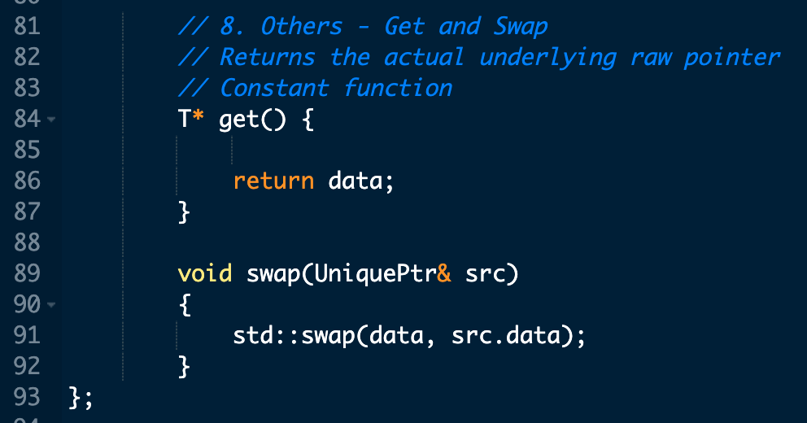

    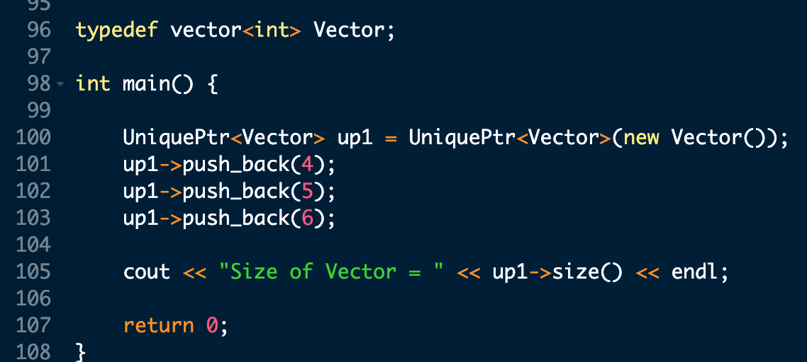

    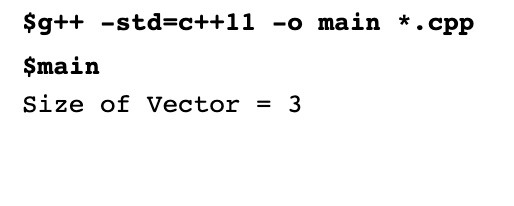

### Shared Pointer:

*  Referenced-counted Smart Pointer
*  A count is kept as to how many shared_ptrs are pointing to the managed object
*  When the last shared_ptr is destroyed, and count goes to zero, the managed object is automatically deleted
*  Called a shared_ptr because ownership of the object is shared among shared_ptrs
*  Any one shared_ptr can keep the managed object alive. Object deleted only when last shared_ptr goes out of scope

* Problems with Shared pointer:
	* With referenced-counted shared_ptrs, if there is a ring or cycle, then shared_ptrs can keep each other alive

	* Objects will be alive even if no other shared_ptrs are not pointing to the managed object from the outside universe

	* 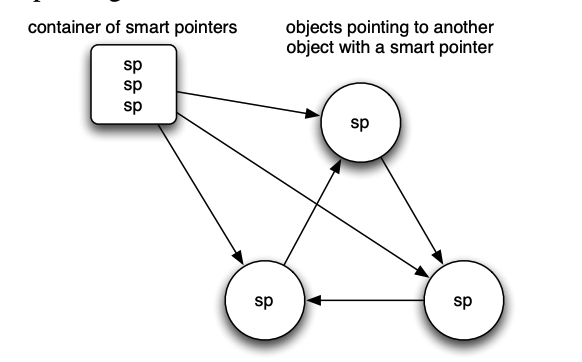

	* Solution to the Ring Problem:
		* We can use Weak Pointers over here. 
		* They only observe an object but do not influence the lifetime and existence of the object
		* If ring of objects point to each other with weak pointers, then when last shared_pointer from outside universe goes out of scope, the managed object will get deleted
  
	* 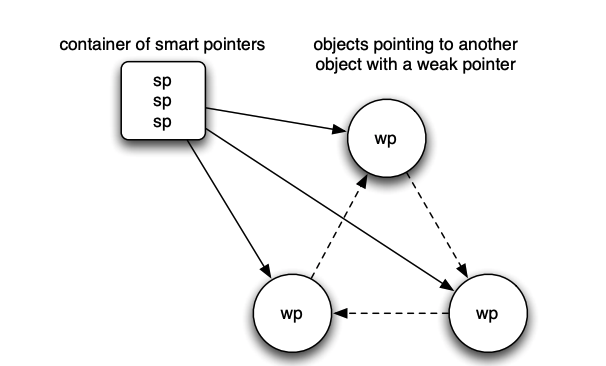

### Weak Pointers:

  * Unlike, raw pointers, weak pointers have an advantage that they know whether the managed object is still in existence or not
  * Weak pointer can look at the manager object and can tell whether the managed object is still in existence or has died

### Flow of Shared and Weak Pointers:

  * **Firstly:**
	* The process starts when the first shared pointer(sp1) is created to point to a managed object
	* Sp1 creates a manager object pointing to this managed object
	* Manager object also contains the reference counts for other shared pointers and weak pointers

  * **Secondly:**
	* If another shared pointer(sp2) is created by copy or assignment from sp1, then it also points to the same manager object
	* At this moment, reference count is incremented for the shared count
		
  * **Likewise:**
	* If another weak pointer is created by copy or assignment from another shared pointer or weak pointer, it also points to the same manager object
	* Again, reference count is incremented, but this time for the weak count

  *  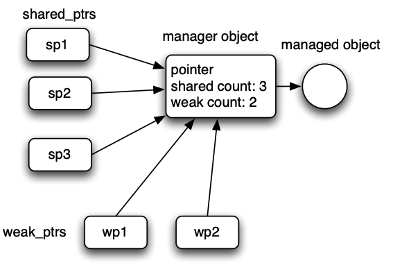	
		
  * Any of the Shared or Weak pointer is destroyed:
  
	* Whenever a shared_ptr is destroyed, or reassigned to point to a different object, the shared_ptr destructor or assignment operator decrements the shared count in the manager object
  
	* If the shared count reaches 0, the shared_ptr destructor deletes the managed object, and sets the pointer to 0. However, if the weak count is greater than 0 at this point, manager object will still be in existence, even if managed object has been deleted

		* Managed Object lifetime - 	As long as the shared count is greater than zero
		* Manager object lifetime - 	As long as any of the shared count and weak count - both are greater than zero
			
			
### Fundamental difference between shared and weak pointers:
  * Shared_ptr can be used syntactically almost identically to a built-in pointer
  * You can basically do only 2 things with the weak pointer:
    * Check whether the managed object is still in existence or not
    * If the managed object is still in existence, you may create a shared_ptr from the weak pointer
		
### Restrictions in using shared_ptr and weak_ptr:
  * It should always be ensured that there is only one manager object for the managed object
  * Meaning, only the first shared pointer creates the manager object
	* And then, all other shared and weak pointer afterwards are created from the first shared pointer only
	* To ensure this, the shared_ptr should always be initialized using the "make_shared" function
	
	
	
### Using the shared_ptr:

*  
  

*  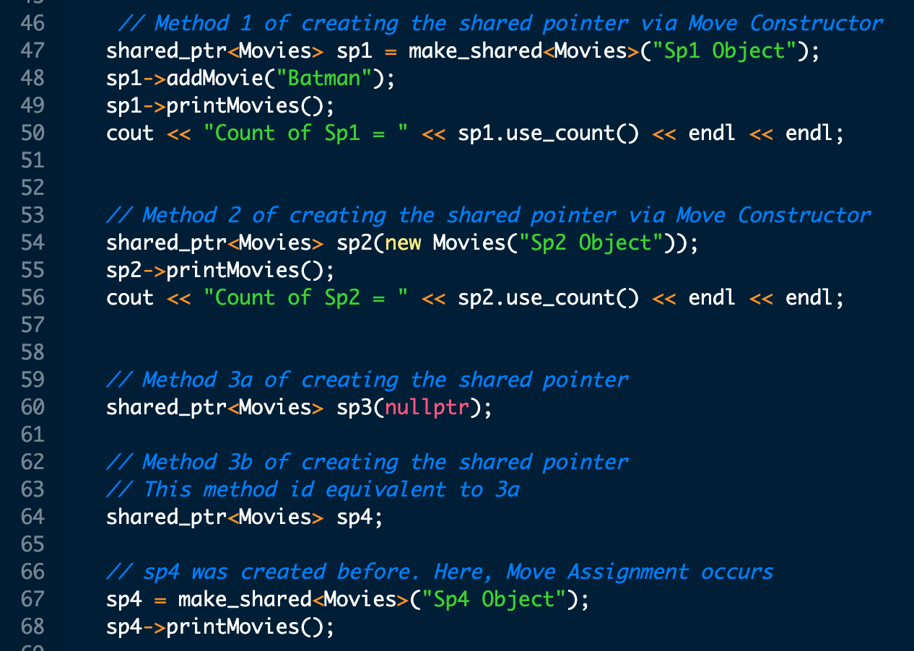

*  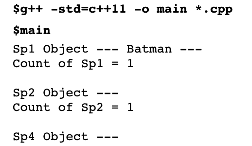

*  

*  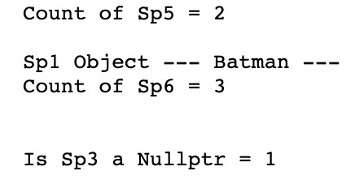	

*  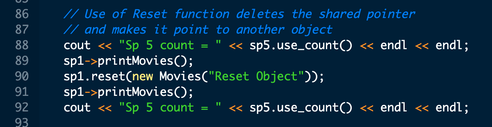	

*  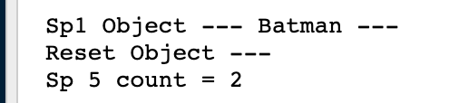	

*  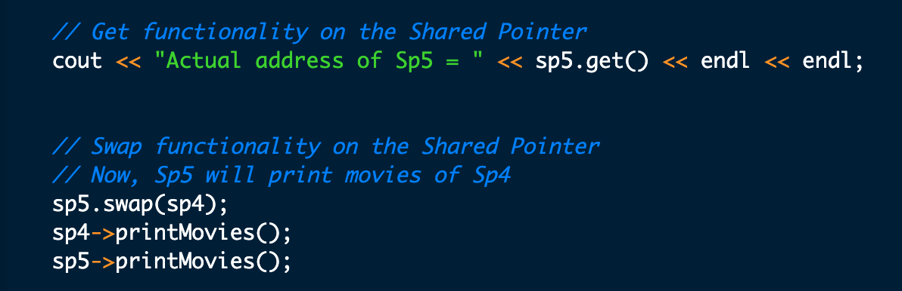	

*  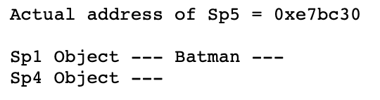	

			
### Using the weak_ptr:
			
*  
  

*  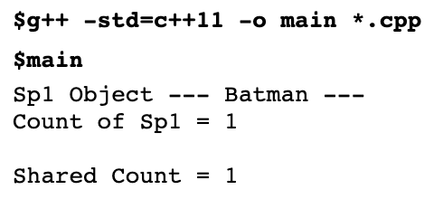

*  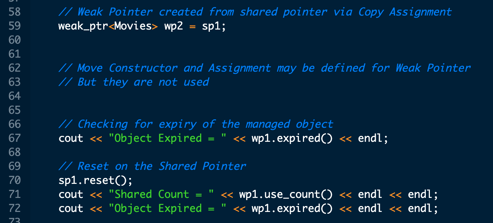

*  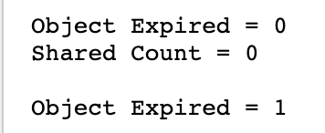

*  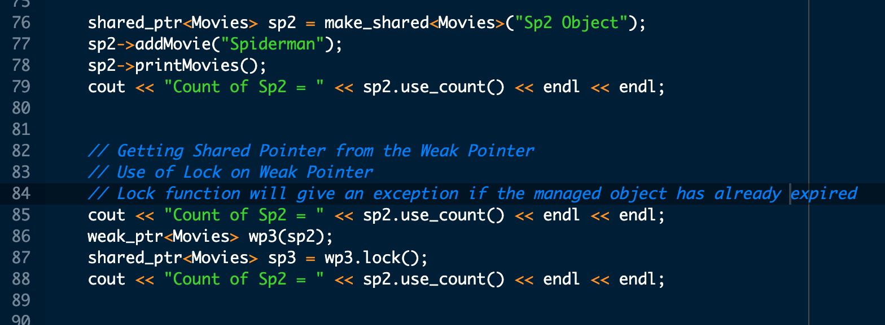	

*  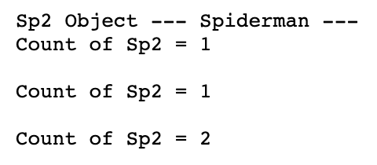	
	
			
			
			
			
			
### Unique Pointer:

		i. Owns the object to which it points to. Has the obligation to destroy the pointed object after the scope
		
		ii. Unique Ownership - Unique Pointer cannot be copied:
			1) Does not have a copy constructor
			2) Does not have a Copy Assignment
			3) Has Move Constructor and Move Assignment
			4) In case of Move Assignment, the original pointer is lost and no longer owns the original object

		iii. It stores a pointer and deletes the object pointed to using the associated deleter

		iv. Uses:
			5) Returning dynamically allocated memory from a function

		
	
	12. Benefits of Unique Pointer over shared pointer:
		i. Unique pointer has no overhead - it only carries the underlying object pointer
		ii. Shared Pointer
			1) It carries the overhead of the manager object
			2) Overhead of increasing and decreasing the reference count
			
	13. Usage Of Unique Pointers:
		
		1. Move Constructor:
		
			
		
			
			
			
			
		2. Copy Assignment:
		
		
		
		
		
		
	
		
		
		
		
		1. Copy Constructor:
		
		
		
		
		
		
		
		
		
	
		4. Move Assignment:

		
		
		
		
		
